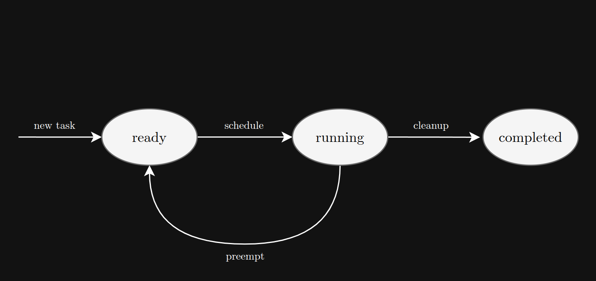
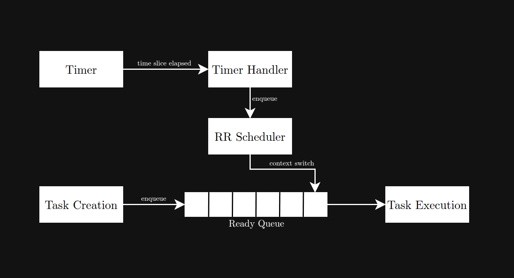

# Green Threads using Preemptive RR Scheduling

<div style="float: right; margin-top: 10px; margin-left: 20px;">
    
</div>

### Description
Virens is a minimal green threads library, that uses preemptive RR scheduling to achieve concurrency via preemptive multitasking.
<br></br>

### Basic Characteristics
- Threads here are called *tasks*, tasks have three main states: <u>ready</u>, <u>running</u>, and <u>completed</u>.
- A single FIFO queue maintains the ready tasks.
- There is only one running task at any given time.
- Tasks are scheduled using preemptive RR scheduling.

### "Software Architecture"
The design and architecture of this library is very simple. The scheduler owns the tasks with the user keeping handles to the tasks. A running task can only reach one of three states: completion, time slice expiry, or some error state where it is evicted and error handling is the user's responsibility. The scheduler priotizes fairness over all else; it simply divides time equally for all tasks in queue. Task functions must take a void* argument and return a void*; the user must wrap their functions if needed.

<br></br>
<center>
    
</center>
<center>Task State Diagram</center>
<br></br>


<center>
    
</center>
<center>Task Block Diagram</center>
<br></br>

```scheduler_init() -> task_create() -> scheduler()```

#### Possible Features:
- Maintain blocking queue for blocked tasks (e.g., tasks waiting for IO)
- Add task priorities
- Prevent task starvation using aging
- Compute statistics (e.g., no. of context switches, throughput, etc.)

**NOTE:** The user creates all tasks at once and hands them to the scheduler to run. It would've been much more useful to have two separate threads, one for the user to create tasks (producer) and another for the scheduler to run them (consumer); however, this is a toy project, and I really don't want to deal with the multitude of edge cases that arise from this (e.g., race conditions from getting SIGALRM while creating a task).
